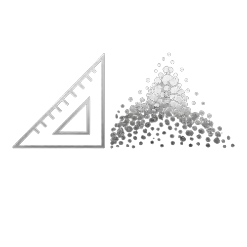

  

<h1 align="center" style="margin-top: 0px;"><a style="color: white; text-decoration: none;" href="https://depth2metric.abdelazizwf.dev">Depth2Metric</a></h1>

Distance measurement in metric units using depth estimation from monocular images.

## Description

Estimate depth values from RBG images using [MiDaS](https://pytorch.org/hub/intelisl_midas_v2/) and turn them into point cloud using [Open3D](https://www.open3d.org/) for depth visualization.
The goal is to use the depth values with a camera model to measure distances within the image in real units.
